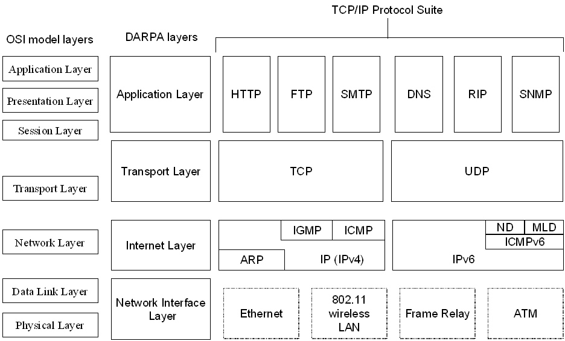
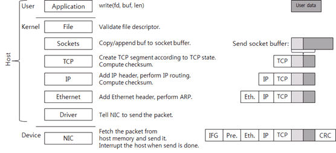
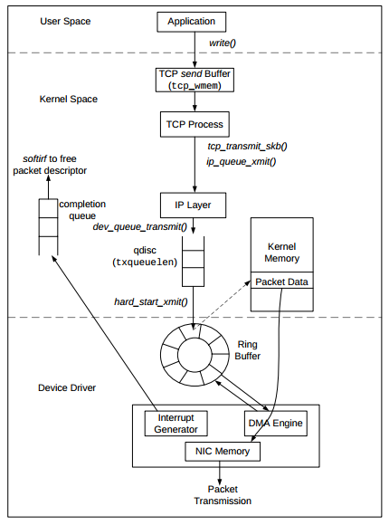
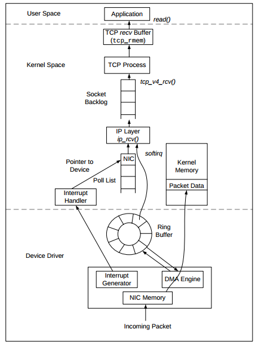

# web-internals
Learning how the web works.

The web we use today is built with TCP/IP protocol suite. There are 4 layers according to specs:
1. Application layer 
2. Transport layer
3. Internet layer
4. Network Interface layer

Web browsers are applications which use HTTP protocol. When we type URLs in browser address bar, the following steps are executed.

1. [HTTP](/http.md)
2. [DNS](/dns.md)
3. [TCP/IP](tcp_ip.md)

 
[Understanding TCP/IP Network Stack & Writing Network Apps](http://www.cubrid.org/blog/dev-platform/understanding-tcp-ip-network-stack/)

more precisely,

[more info](http://www.cnblogs.com/ggjucheng/archive/2012/11/01/2750217.html)

Packet transmission occurs through cables/wireless media via routers, bridges, repeaters, gateways & other networking devices, and finally reach the destination server.

Server responds to client requests with HTML/other media files.

If it is an NGINX server, routing is done based on specified routes in the config file.
NGINX can act as gateway interface to incompatible server applications. For example, routes to Flask/Django server have to be send via WSGI. After processing the request, response is send back to NGINX, which responds back to the client on the same way.
[read more on this](https://ruslanspivak.com/lsbaws-part1/)

When client receive response packet, same processes are reversed.

Now browser will start parsing & rendering the response file,
[here is how browsers do that](http://www.html5rocks.com/en/tutorials/internals/howbrowserswork/).