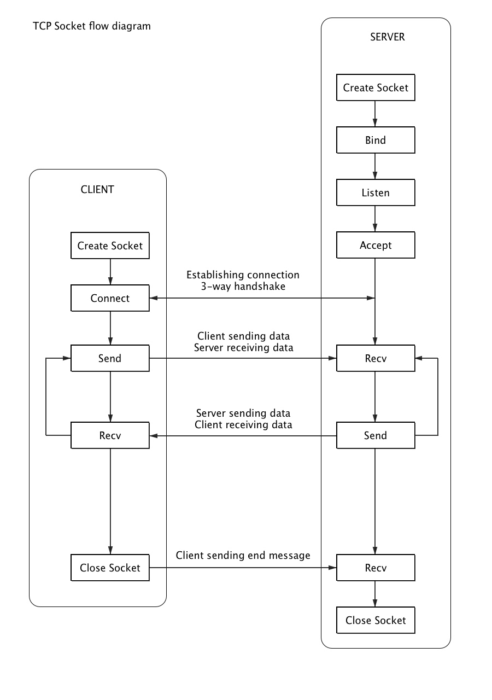
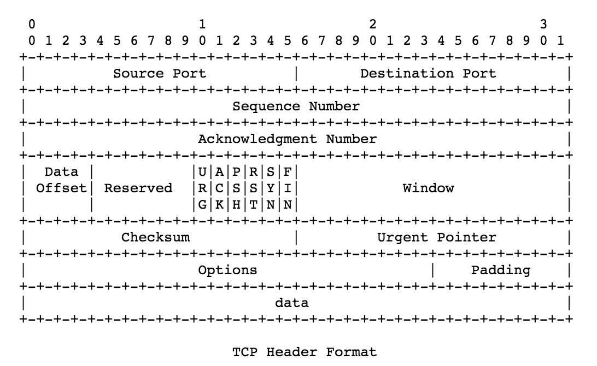
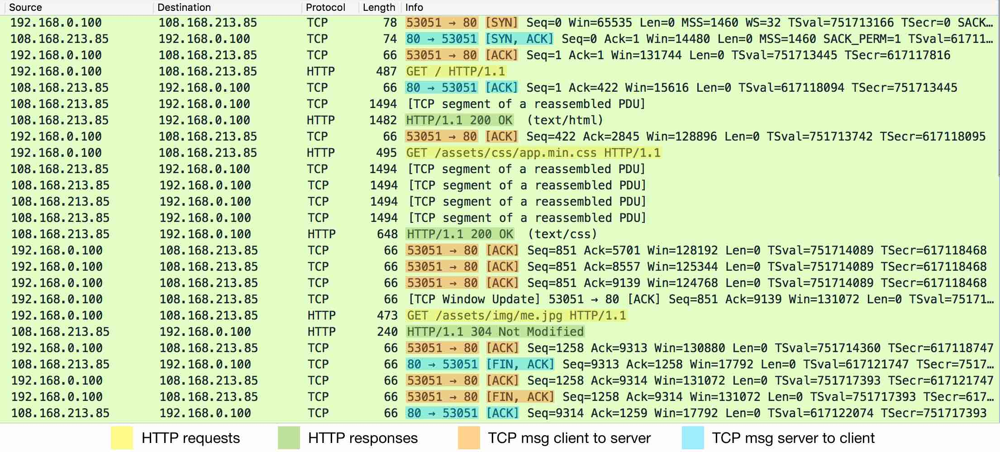
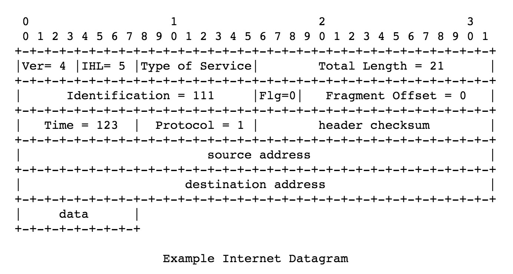

# TCP/IP

## Sockets
IP address identifies which host & Port number identifies which appication for a connection. 
The IP-Port combination is strictly known as an **endpoint** and is sometimes called a **socket**.

The client-server socket pair `<client IP address, client port number, server IP address, server port number>` tuple specifies the two endpoints that uniquely identifies each TCP connection in an internet. 

Sockets can be thought of as an application's interface to the network. Typical library implementations present a Socket class, an instance of which is used to create and manage a connection. Network appications (such as browsers) can directly make use of these socket functions to send & recv data.

 

  - [Linux socket implementation](https://github.com/torvalds/linux/blob/master/net/socket.c)
  - [Chromium socket implementation files](https://github.com/nwjs/chromium.src/tree/a464d98d0f0ccef34bc0ce30be38a3c497c86c1a/net/socket)

## Transmission Control Protocol

[RFC 793](https://www.ietf.org/rfc/rfc793.txt)

TCP ensures end-to-end reliable delivery.

#### TCP header format

#### TCP flow control
The TCP connection is initiated by 3-way handshake (`SYN`, `SYN-ACK`, `ACK`). Then there will be `ACK` for each request/response between client & server. Finally at the end, client sends `FIN`, server confirms with `ACK` & `FIN`, and then client ends with `ACK`.

#### TCP states

source: [Wikipedia](https://en.wikipedia.org/wiki/File:Tcp_state_diagram_fixed_new.svg)

Here is more info: [Know your TCP system call sequences](http://www.ibm.com/developerworks/aix/library/au-tcpsystemcalls/)

-------------------------------------------

## IP

[RFC 791](https://tools.ietf.org/html/rfc791)

The internet protocol provides for transmitting blocks of data called datagrams from sources to destinations, where sources and destinations are hosts identified by fixed length addresses.
It also provides fragmentation and reassembly for long packets.

